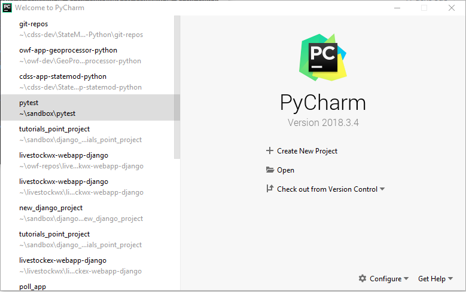
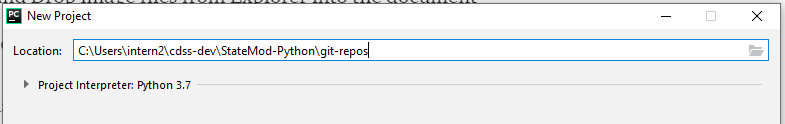

## StateMod-Python ##

CDSS prototype of StateMod written in Python

* [Introduction](#introduction)
* [Repository Contents](#repository-contents)
* [Getting Started](#getting-started)
* [Contributing](#contributing)
* [Maintainers](#maintainers)
* [License](#license)
* [Contact](#contact)

## Introduction ## 

The code in this repository, and other dependency repositories, was ported from the Java code found in the separate repository [cdss-app-statemod-java](https://github.com/OpenCDSS/cdss-app-statemod-java), in an effort to determine which programming language would be best suited for converting the StateMod software from Fortran to another language. The initial StateMod code in Fortran was converted to Java by [@Smalers](https://github.com/smalers) at the Open Water Foundation. The Java code was then converted to C# before being ported and converted to Python. The C# code can be found in the repository [cdss-app-statemod-cs](<https://github.com/OpenCDSS/cdss-app-statemod-cs>). 

The process for porting the code from Java to Python was as follows:

All code was converted by hand, since there was no competent automatic Java to Python converter for Python3.x. The first file ported over was `StateMod_Main.py` as the entry point for the program. Additional files were added with the necessary classes and functions that were needed by this entry point. Files were added in a branching manner to ensure that all code had access to the necessary classes and functions to run properly. 

The files currently supported by StateMod-Python are:

- `.rsp` 
- `.dds`
- `.ddr`
- `StateMod_StreamGage` (`.rin`, `.ris`)
- All Time Series files read by `StateMod_TS.py` 

## Repository Contents ##

The following folder structure is recommended for development.
Top-level folders should be created as necessary.
The following folder structure clearly separates user files (as per operating system),
development area (`cdss-dev`), product (`StateMod-Python`), repositories for product (`git-repos`),
and specific repositories for the product.
Repository folder names should agree with GitHub repository names.
Scripts in repository folders that process data should detect their starting location
and then locate other folders based on the following convention.

*See **Getting Started** below to easily download all repositories to a local environment* 

```
C:\Users\user\                                 User's home folder for Windows.
/c/Users/user/                                 User's home folder for Git Bash.
/cygdrive/C/Users/user/                        User's home folder for Cygwin.
/home/user/                                    User's home folder for Linux.
  owf-cdss/                                    Projects that are part of Colorado's Decision Support Systems.
    StateMod-Python/                               StateMod C# product folder.
                                               (name of this folder is not critical).
      ---- below here folder names should match exactly ----
      git-repos/                               Git repositories for the Angular portal web application.
        cdss-app-statemod-python/              Statemod Python main application code (this repo).
        cdss-lib-cdss-python/                  Library shared between CDSS components.
        cdss-lib-common-python/                Library of core utility code used by multiple repos.
        cdss-lib-models-python/                Library to read/write CDSS StateCU and StateMod  model files.
```

This repository contains the following:
```
cdss-app-statemod-python
   .git/                                       Standard Git software folder for repository (DO NOT TOUCH).
   .gitattributes/                             Standard Git configuration file for repository (for portability).
   .gitignore/                                 Standard Git configuration file to ignore dynamic working files.
   .build-util/                                Scripts to help in the StateMod Python development environment.
   src/
     cdss/
       statemod/
         app/                                  Contains StateMod_Main.py, main entry point to the application
   test/
     datasets/
       cdss-yampa/                             Tests for StateMod application
   README.md                                   This readme file
   LICENSE.md                                  StateMod Java license file.
```

## Getting Started ##

#### Setting up development environment: ####

##### Download necessary repositories #####

1. Set up folder structure as above and `cd` into `git-repos` 
2. Clone main repository: `git clone https://github.com/OpenCDSS/cdss-app-statemod-python.git` 
3. `cd` into `cdss-app-statemod-python/build-util/` 
4. run `git-clone-all-sm.sh` and follow through the prompts. This should automatically download the remaining repositories locally. 

##### Install PyCharm: #####

1. Go to the [PyCharm Download](<https://www.jetbrains.com/pycharm/download/#section=windows>) page.
2. Select ***Download*** for the Community edition.
3. If working on Windows machine, run the downloaded `.exe` file and follow the installation steps in the install wizard.

##### Setting up a StateMod-Python project in PyCharm: #####

1. `cd` into `cdss-app-statemod-python/build-util/` 
2. run `run-pycharm-statemod.bat`. This script is specifically designed to open PyCharm with the appropriate dependencies loaded into the project. It may take a few moments to open.
3. If no previous PyCharm project is opened the following window should display: 
4. Click ***Create New Project*** 
5. Set the Location for the new project to be the path to the StateMod python repositories as such: 
6. PyCharm will ask "The directory 'C:\Users\username\cdss-dev\StateMod-Python\git-repos' is not empty. Would you like to create a project from existing sources instead?". Click ***Yes***.   
7. All files will be loaded into a new PyCharm project, and the script to open PyCharm should ensure the python path is correct as to import all other dependency repositories.
8. Right Click on the main repository `cdss-app-statemod-python` and select ***Mark Directory as*** > ***Sources Root*** to let PyCharm know this is the main repository which depends on all the rest.

##### Edit run configurations: #####

1. Click on ***Run*** > ***Edit Configurations***... Select ***StateModMain*** under the ***Python*** tab
2. For development and testing purposes the following parameters have been passed to the run configurations to test using the file `ym2015.rsp`. 
3. Parameters: `-sim ../../../../test/datasets/cdss-yampa/StateMod/ym2015.rsp`
4. Click ***Apply*** and ***OK***
5. Now the program should be able to be run by doing **Shift** + **F10**. 

To see output after StateMod has been run open the file `cdss-app-statemod-python/test/datasets/cdss-yampa/StateMod/ym2015.rsp.sim.log`. 

## Contributing ##

Contributions to this project can be submitted using the following options:

1. StateMod Python software developers with commit privileges can write to this repository
    as per normal OpenCDSS development protocols.
2. Post an issue on GitHub with suggested change.  Provide information using the issue template.
3. Fork the repository, make changes, and do a pull request.
    Contents of the current master branch should be merged with the fork to minimize
    code review before committing the pull request.

See also the [OpenCDSS / StateMod protocols](http://learn.openwaterfoundation.org/cdss-website-opencdss/statemod/statemod/).

## Maintainers ##

* Justin Rentie, Open Water Foundation ([@jurentie](https://github.com/jurentie))
* Steve Malers, Open Water Foundation ([@Smalers](https://github.com/smalers))

## License ##

Copyright Colorado Department of Natural Resources.

The software is licensed under GPL v3+. See the [LICENSE.md](LICENSE.md) file.

## Contact ##

See the [OpenCDSS StateMod information for product contacts](http://learn.openwaterfoundation.org/cdss-website-opencdss/statemod/statemod/#product-leadership).
