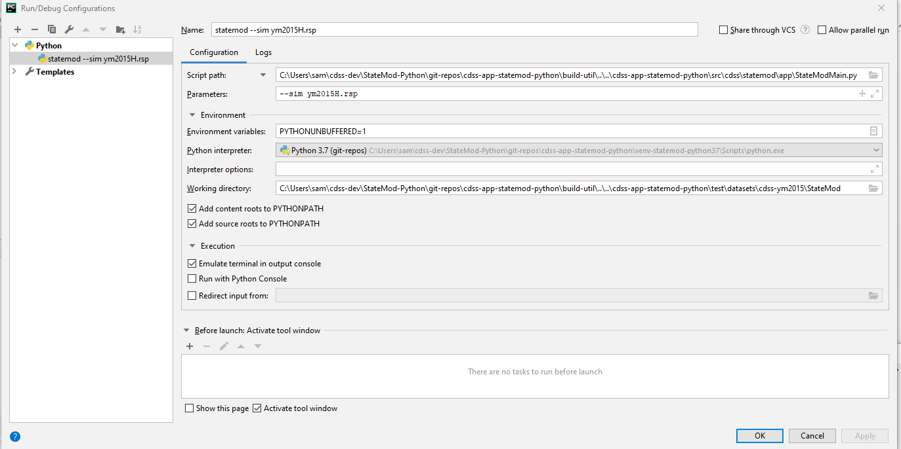

# cdss-app-statemod-python #

CDSS prototype of StateMod written in Python

* [Introduction](#introduction)
* [Repository Contents](#repository-contents)
* [Development Environment Setup](#development-environment-setup)
* [Contributing](#contributing)
* [Maintainers](#maintainers)
* [License](#license)
* [Contact](#contact)

-------------------

## Introduction ## 

The code in this repository and other related repositories was ported from Java code
in an effort to evaluate which programming language(s) may be suitable for
converting the StateMod software from Fortran to another language.

The StateMod Java prototype was implemented as a simple main program that uses extensive Java libraries that have been
developed for data processing tools including TSTool and StateDMI.
The Java code was ported to Python in this and other Python code repositories (see below) in order to create a Python StateMod prototype.

The main repositories for StateMod language evaluation prototypes are:

* Java:  [cdss-app-statemod-java](https://github.com/OpenCDSS/cdss-app-statemod-java)
* C#:  [cdss-app-statemod-cs](https://github.com/OpenCDSS/cdss-app-statemod-cs) 
* Fortran 2008:  [cdss-app-statemod-f2008](https://github.com/OpenCDSS/cdss-app-statemod-f2008) 
* Python:  this repository

The process for porting the code from Java to Python was as follows: 
All code was converted by hand, since there was no competent automatic Java to Python converter for Python3.x.
The first file ported over was `StateMod_Main.py` as the entry point for the program.
Additional files were added with the necessary classes and functions that were needed by this entry point.

The StateMod dataset files that are currently supported by StateMod-Python are:

- `.rsp` 
- `.dds`
- `.ddr`
- `StateMod_StreamGage` (`.rin`, `.ris`)
- all time series files read by `StateMod_TS.py` 

## Repository Contents ##

The following folder structure is recommended for development.
Top-level folders should be created as necessary.
The following folder structure clearly separates user files (as per operating system),
development area (`cdss-dev`), product (`StateMod-Python`), repositories for product (`git-repos`),
and specific repositories for the product.
Repository folder names should agree with GitHub repository names.
Scripts in repository folders that process data should detect their starting location
and then locate other folders based on the following convention.

See [Development Environment Setup](#development-environment-setup) below to easily download all repositories to a local environment.

```
C:\Users\user\                                 User's home folder for Windows.
/c/Users/user/                                 User's home folder for Git Bash.
/cygdrive/C/Users/user/                        User's home folder for Cygwin.
/home/user/                                    User's home folder for Linux.
  owf-cdss/                                    Projects that are part of Colorado's Decision Support Systems.
    StateMod-Python/                           StateMod Python product folder.
                                               (name of this folder is not critical).
      ---- below here folder names should match exactly ----
      git-repos/                               Git repositories for the StateMod Python application.
        cdss-app-statemod-python/              Statemod Python main application code (this repo).
        cdss-lib-cdss-python/                  Library shared between CDSS components.
        cdss-lib-common-python/                Library of core utility code used by multiple repos.
        cdss-lib-models-python/                Library for CDSS StateCU and StateMod  model files.
```

This repository contains the following:
```
cdss-app-statemod-python
  .git/                                        Standard Git folder for repository (DO NOT MODIFY).
  .gitattributes/                              Standard Git configuration file for repository (for portability).
  .gitignore/                                  Standard Git configuration file to ignore dynamic working files.
  build-util/                                  Scripts to help in the StateMod Python development environment.
  src/
    cdss/
      statemod/
        app/                                   Contains StateMod_Main.py, main entry point to the application.
  test/
    datasets/
      cdss-ym2015/                             Tests for StateMod application - Yampa dataset input files.
  README.md                                    This file.
  LICENSE.md                                   StateMod Python license file.
```

## Development Environment Setup ##

The following instructions explain how to set up the StateMod Python development environment on Windows.
It is assumed that Git for Windows has been installed.  Git Bash will be used for some steps.

### Install PyCharm ###

1. Go to the [PyCharm Download](<https://www.jetbrains.com/pycharm/download/#section=windows>) page.
2. Select ***Download*** for the Community edition.
3. If working on a Windows computer, run the downloaded `.exe` file and follow the installation steps in the install wizard.
Accept the defaults.

### Download necessary repositories ###

Several Python repositories are used, matching Java code repositories that were ported to Python for this prototype.
Each repository is cloned to collectively result in the StateMod Python software.

1. Create a folder:  `C:\Users\user\cdss-dev\StateMod-Python\git-repos`
2. Using Git Bash:
	1. `cd` to the `git-repos` folder.
	2. Clone main repository: `git clone https://github.com/OpenCDSS/cdss-app-statemod-python.git` 
	3. `cd cdss-app-statemod-python/build-util` 
	4. Run `./git-clone-all-sm.sh` and follow the prompts to clone related repositories.
	This will automatically download the remaining repositories locally
	if they do not already exist. 

### Set up a StateMod-Python project in PyCharm ###

PyCharm uses a "project" to manage software.
This is different than Eclipse/Java, which uses a workspace that contains multiple projects.
Because it is easy to set up a PyCharm project and because project files will be modified for different developers,
it is best to NOT store PyCharm project files in repositories.
Therefore, the following steps describe how to set up a new Python project
that uses multiple GitHub repositories, each containing Python code.
This approach can be revised later if a better approach is determined.

1. Start PyCharm from the ***Start / JetBrains / PyCharm*** menu for the desired (typically most recent) version.
**Do not use the run script described below in step 6.**
It may take awhile to open.
If PyCharm has been used before, it may list previous projects to open.<br>

2. Click ***Create New Project***  to create a new project.
If the welcome screen is not as shown above and PyCharm remembers an old project configuration,
use the ***File / New Project*** to configure a new project, which will replace the remembered projected.
Select the location for the new project to be the `C:\Users\user\cdss-dev\StateMod-Python\git-repos` folder
(or otherwise be consistent with location of source files).
Specifying the `git-repos` folder
will allow PyCharm to see the multiple code folders from separate repositories.
Complete the information for new project as shown below.
Note that the folder for Python virtual environment in this case is in the `git-repos/cdss-app-statemod-python` folder.
The folder that is chosen in the repository should be added to the `.gitignore` file if it does
not match the existing pattern in that file.<br>

3. Press ***Create***.
PyCharm will ask "The directory 'C:\Users\user\cdss-dev\StateMod-Python\git-repos' is not empty.
Would you like to create a project from existing sources instead?".
Click ***Yes*** to associate the PyCharm project with existing Git repository files.
4. All files will be loaded into a new PyCharm project.
A folder `git-repos/.idea/` will be created with PyCharm project files,
which will not be saved in any repository.
If the virtual environment folder is not created,
then create it by following the
[PyCharm Virtual Environment instructions](https://www.jetbrains.com/help/pycharm/creating-virtual-environment.html)
and the folder shown in the above image.
5. For each repository, expand the folders, select the `src` folder, right-click and select
***Mark Directory as / Sources Root*** to let PyCharm know which folders contain source code
that will be known for Python `import` statements.
The PyCharm interface will be similar to the following:<br>

6. Subsequently, use Git Bash to start PyCharm and load the project that has been created:
	1. For the repository `cdss-app-statemod-python`, `cd cdss-app-statemod-python/build-util` 
	2. Run `run-pycharm-statemod.bat` in a Windows Command Prompt window.
	This batch file will run PyCharm by specifying the project to open.

The virtual environment as initially installed will have minimal additional Python packages installed.  
To view the list, use ***File / Settings*** and then ***Project: / Project Interpreter***.
Installed packages will be listed.  The following additional packages need to be installed:

* `pip` - should be installed by default, used to download and install packages
* `psutil` - process utilities, needed to determine memory usage
* `setuptools` - should be installed by default, used to create deployable packages

### Edit Run Configurations ###

Run configurations are used to run the StateMod software from within PyCharm,
using the Python virtual environment that was created when the project was created.
Running StateMod from the interface displays console information output in the
***Python Console*** panel in the PyCharm interface.

The repository contains input files for the CDSS Yampa dataset and can
be configured as shown below.
Unfortunately, the run configurations are stored in the `.idea/workspace.xml` file,
which is not saved in a repository.
Therefore, run configurations need to be defined for each user.
This can be improved by implementing tests outside of PyCharm run configurations.
Run configurations for other datasets can be configured similarly, as described in the following steps,
although datasets other than ym2015 are not saved in the repository.
The following steps define and run a configuration for the Yampa historical dataset.

1. Click on ***Run*** > ***Edit Configurations...***.
2. Select ***Templates / Python*** and then the ***+*** to add a Python run configuration
that used the template.
Specify the configuration as shown.
An attempt to use PyCharm configuration variables rather than full paths was not successful,
but there may be a way to do this.<br>

3. Click ***OK*** to save the configuration.
4. Now the program should be able to be run by doing **Shift** + **F10** or use the ***Run*** menu. 

To see output after StateMod has been run open the file `cdss-app-statemod-python/test/datasets/cdss-ym2015/StateMod/ym2015.rsp.sim.log`. 

### Add Additional Datasets ###

The CDSS Yampa dataset is saved in the repository for basic development and testing.
However, it is also useful to try the software with other datasets that are not saved in the repository.
To add other datasets, download from the CDSS website and copy the `StateMod` folder into the
`test\datasets` folder, for example `test\datasets\cdss-cm2015\StateMod` for Colorado model.
Then create a run configuration similar to that described in the previous section.

### Run PyCharm After Initial Setup ###

To run PyCharm after initial setup,
open a Windows Command prompt window, change to `build-util` folder and run `run-pycharm-statemod.bat`.
This batch file will run PyCharm by specifying the project to open.

## Contributing ##

Contributions to this project can be submitted using the following options:

1. StateMod Python software developers with commit privileges can write to this repository
    as per normal OpenCDSS development protocols.
2. Post an issue on GitHub with suggested change.  Provide information using the issue template.
3. Fork the repository, make changes, and do a pull request.
    Contents of the current master branch should be merged with the fork to minimize
    code review before committing the pull request.

See also the [OpenCDSS / StateMod protocols](http://opencdss.state.co.us/opencdss/statemod/)

## License ##

Copyright Colorado Department of Natural Resources.

The software is licensed under GPL v3+. See the [LICENSE.md](LICENSE.md) file.

## Contact ##

See the [OpenCDSS StateMod information for product contacts](http://opencdss.state.co.us/opencdss/statemod/#software-developers).
