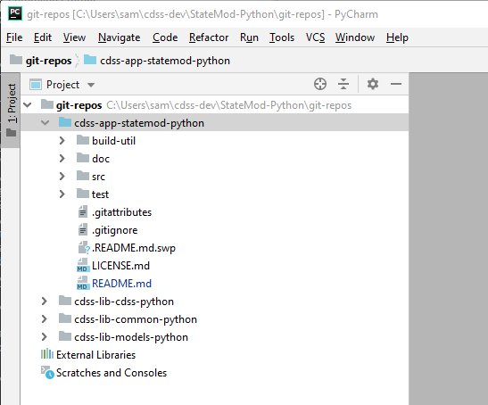

## StateMod-Python ##

CDSS prototype of StateMod written in Python

* [Introduction](#introduction)
* [Repository Contents](#repository-contents)
* [Development Environment Setup](#development-environment-setup)
* [Contributing](#contributing)
* [Maintainers](#maintainers)
* [License](#license)
* [Contact](#contact)

## Introduction ## 

The code in this repository, and other related repositories,
was ported from the Java code found in the separate repository
[cdss-app-statemod-java](https://github.com/OpenCDSS/cdss-app-statemod-java),
in an effort to determine which programming language would be best suited for
converting the StateMod software from Fortran to another language.
The initial StateMod code in Fortran was converted to Java by [@Smalers](https://github.com/smalers) at the Open Water Foundation.
The Java code was then converted to C# before being ported and converted to Python.
The C# code can be found in the repository [cdss-app-statemod-cs](<https://github.com/OpenCDSS/cdss-app-statemod-cs>). 

The process for porting the code from Java to Python was as follows:

All code was converted by hand, since there was no competent automatic Java to Python converter for Python3.x.
The first file ported over was `StateMod_Main.py` as the entry point for the program.
Additional files were added with the necessary classes and functions that were needed by this entry point.
Files were added in a branching manner to ensure that all code had access to the necessary classes and functions to run properly. 

The files currently supported by StateMod-Python are:

- `.rsp` 
- `.dds`
- `.ddr`
- `StateMod_StreamGage` (`.rin`, `.ris`)
- All Time Series files read by `StateMod_TS.py` 

## Repository Contents ##

The following folder structure is recommended for development.
Top-level folders should be created as necessary.
The following folder structure clearly separates user files (as per operating system),
development area (`cdss-dev`), product (`StateMod-Python`), repositories for product (`git-repos`),
and specific repositories for the product.
Repository folder names should agree with GitHub repository names.
Scripts in repository folders that process data should detect their starting location
and then locate other folders based on the following convention.

*See [Development Envrironment Setup](#development-environment-setup) below to easily download all repositories to a local environment* 

```
C:\Users\user\                                 User's home folder for Windows.
/c/Users/user/                                 User's home folder for Git Bash.
/cygdrive/C/Users/user/                        User's home folder for Cygwin.
/home/user/                                    User's home folder for Linux.
  owf-cdss/                                    Projects that are part of Colorado's Decision Support Systems.
    StateMod-Python/                           StateMod C# product folder.
                                               (name of this folder is not critical).
      ---- below here folder names should match exactly ----
      git-repos/                               Git repositories for the Angular portal web application.
        cdss-app-statemod-python/              Statemod Python main application code (this repo).
        cdss-lib-cdss-python/                  Library shared between CDSS components.
        cdss-lib-common-python/                Library of core utility code used by multiple repos.
        cdss-lib-models-python/                Library to read/write CDSS StateCU and StateMod  model files.
```

This repository contains the following:
```
cdss-app-statemod-python
   .git/                                       Standard Git software folder for repository (DO NOT TOUCH).
   .gitattributes/                             Standard Git configuration file for repository (for portability).
   .gitignore/                                 Standard Git configuration file to ignore dynamic working files.
   .build-util/                                Scripts to help in the StateMod Python development environment.
   src/
     cdss/
       statemod/
         app/                                  Contains StateMod_Main.py, main entry point to the application
   test/
     datasets/
       cdss-yampa/                             Tests for StateMod application
   README.md                                   This readme file
   LICENSE.md                                  StateMod Java license file.
```

## Development Environment Setup ##

The following instructions explain how to set up the StateMod Python development environment on Windows.
It is assumed that Git for Windows has been installed.  Git Bash will be used for some steps.

### Install PyCharm ###

1. Go to the [PyCharm Download](<https://www.jetbrains.com/pycharm/download/#section=windows>) page.
2. Select ***Download*** for the Community edition.
3. If working on a Windows computer, run the downloaded `.exe` file and follow the installation steps in the install wizard.

### Download necessary repositories ###

1. Create a folder:  `C:\Users\user\cdss-dev\StateMod-Python\git-repos`
2. Using Git Bash:
	1. `cd` to the `git-repos` folder.
	2. Clone main repository: `git clone https://github.com/OpenCDSS/cdss-app-statemod-python.git` 
	3. `cd cdss-app-statemod-python/build-util` 
	4. Run `build-util/git-clone-all-sm.sh` and follow through the prompts.
	This will automatically download the remaining repositories locally. 

### Set up a StateMod-Python project in PyCharm ###

PyCharm uses a "project" to manage software.
This is different than Eclipse/Java, which uses a workspace that contains multiple projects.
Because it is easy to set up a PyCharm project and because project files may vary for different
developers, it is best to NOT store project files in repositories.
Therefore, the following steps describe how to set up a new Python project
that use multiple GitHub repositories, each containing Python code.
This approach can be revised later if a better approach is determined.

1. Start PyCharm from the ***Start / JetBrains / PyCharm*** menu for the desired (typically most recent) version.
**Do not use the run script described below in step 6.**
It may take awhile to open.
If PyCharm has been used before, it may list previous projects to open.

2. Click ***Create New Project*** 
Select the location for the new project to be the `C:\Users\username\cdss-dev\StateMod-Python\git-repos` folder
(or otherwise be consistent with location of source files).
Specifying the `git-repos` folder
will allow PyCharm to see the multiple code folders from separate repositories.
Complete the information for new project as shown below.
Note that the folder for Python virtual environment is at the same level as `git-repos` folder
and not saved in a repository.

3. Press ***Create***.
PyCharm will ask "The directory 'C:\Users\username\cdss-dev\StateMod-Python\git-repos' is not empty.
Would you like to create a project from existing sources instead?". Click ***Yes***. 
4. All files will be loaded into a new PyCharm project.
A folder `git-repos/.idea/` will be created with PyCharm project files,
which will not be saved in any repository.
5. Right Click on the main repository `cdss-app-statemod-python` and select
***Mark Directory as*** > ***Sources Root*** to let PyCharm know this is the main repository
that depends on the other repositories.
The PyCharm interface will be similar to the following:

6. Subsequently, use Git Bash to start PyCharm and load the project that has been created:
	1. For the repository `cdss-app-statemod-python`, `cd cdss-app-statemod-python/build-util` 
	2. Run `run-pycharm-statemod.bat` in a Windows Command Prompt window.
	This batch file will run PyCharm by specifying the project to open.

### Edit Run Configurations ###

Run configurations are used to run the StateMod software from within PyCharm,
using the Python virtual environment that was created when the project was created.
Running StateMod from the interface displays console information output in the
***Python Console*** panel in the PyCharm interface.

The repository contains input files for the CDSS Yampa dataset and can
be configured as shown below.
Unfortunately, the run configurations are stored in the `.idea/workspace.xml` file,
which is not saved in a repository and need to be defined for each user.
Run configurations for other datasets can be configured similarly, as described in the following section,
although datasets are not saved in the repository.
The following steps define and run a configuration for the Yampa historical dataset.

1. Click on ***Run*** > ***Edit Configurations...***.
Select ***StateModMain*** under the ***Python*** tab
2. For development and testing purposes the following parameters have been
passed to the run configurations to test using the file `ym2015.rsp`. 
3. Parameters: `-sim ../../../../test/datasets/cdss-yampa/StateMod/ym2015.rsp`
4. Click ***Apply*** and ***OK***
5. Now the program should be able to be run by doing **Shift** + **F10**. 

To see output after StateMod has been run open the file `cdss-app-statemod-python/test/datasets/cdss-yampa/StateMod/ym2015.rsp.sim.log`. 

### Add Additional Datasets ###

The CDSS Yampa dataset is saved in the repository for basic development and testing.
However, it is also useful to try the software with other datasets that are not saved in the repository.
To add other datasets, download from the CDSS website and copy the `StateMod` folder into the
`test\datasets` folder, for example `test\datasets\cdss-cm2015\StateMod` for Colorado model.
Then create a run configuration similar to that described in the previous section.

### Run PyCharm After Initial Setup ###

## Contributing ##

Contributions to this project can be submitted using the following options:

1. StateMod Python software developers with commit privileges can write to this repository
    as per normal OpenCDSS development protocols.
2. Post an issue on GitHub with suggested change.  Provide information using the issue template.
3. Fork the repository, make changes, and do a pull request.
    Contents of the current master branch should be merged with the fork to minimize
    code review before committing the pull request.

See also the [OpenCDSS / StateMod protocols](http://opencdss.state.co.us/opencdss/statemod/)

## Maintainers ##

* Justin Rentie, Open Water Foundation ([@jurentie](https://github.com/jurentie))
* Steve Malers, Open Water Foundation ([@Smalers](https://github.com/smalers))

## License ##

Copyright Colorado Department of Natural Resources.

The software is licensed under GPL v3+. See the [LICENSE.md](LICENSE.md) file.

## Contact ##

See the [OpenCDSS StateMod information for product contacts](http://opencdss.state.co.us/opencdss/statemod/#software-developers).
